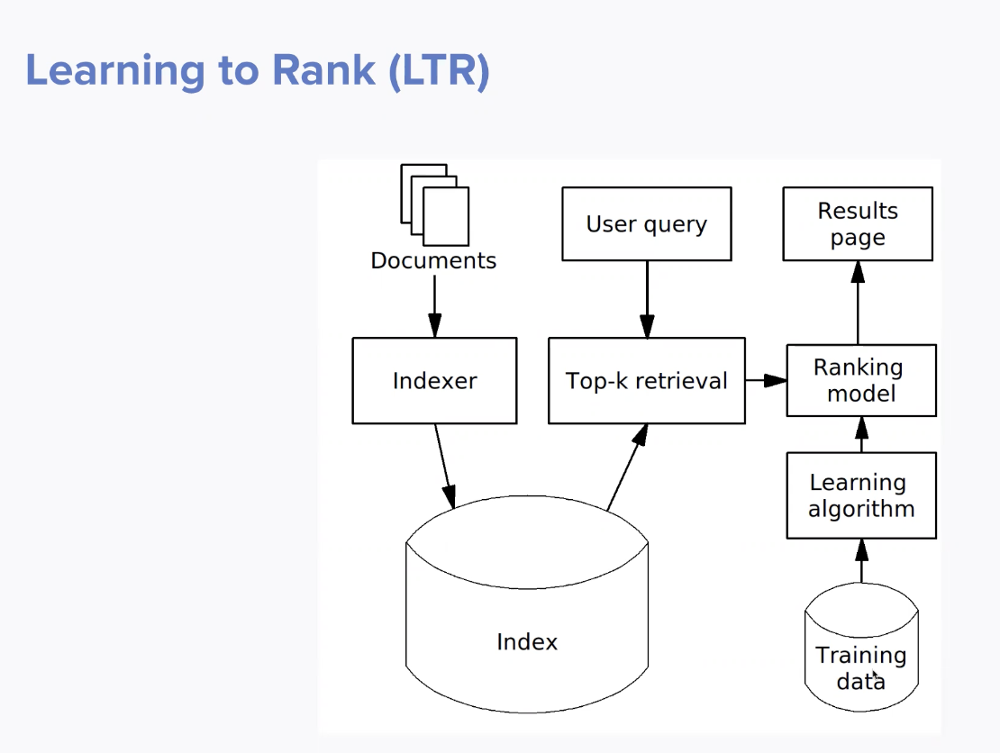

# Week 1

### How to measure relevance? 
* Precision vs recall
	* Precision: how much of the results returned are relevant?
	* Recall: of all the relevant results, how many did I return?
	* A tradeoff
* Get relevance through judgements
	* From users/data (if you care about the subjective "desireability" of results)
	* From human judgements (if you care about the pure/objective "relevance" of the results)
* nDCG: determine relevance result set by how relevant each result is, weighted by position (higher positions are better) 
	* cumulative gain/ value of results discounted by the fact that later results are not as important 
* What really matters: user happiness, business success
	* Think not in terms of search queries, but search sessions -- did the users accomplish what they came to do on the site efficiently?
	* Did you make the "sale"? 

### Ranking Factors
* Queries and documents are in a vector space and measure similarity between the two for retrieval. 
* Way we score results is a combo of ranking factors
* Query-dependent factors
	* no. of matching tokens
	* no. of tokens matching specific fields
	* tf-df, bm25
	* synonyms
* query-independent factors
	* popularity
	* recency
	* prices
	* sales rank 
* also user and contextual factors 

### Techniques to improve ranking
* Hand tuned approach
	* assign boosts to factors
* machine learning: learn how to combine factors
	* learn linear weights to apply OR 
	* tree-based models (nonlinear) 
* outside the box: query + content understanding 
* before machine-learned ranking:
	* synonyms
	* auto-phrasing
	* document & field boosting
	* better analyzers 
	* test these things and learn what is helpful to improve precision/recall/performance 
* machine learning: not just for ranking -- content and query understanding 
* invest in query and content understanding with ML and not just combination (LTR) 
* ML in query + content understanding can give us the factors that we use in LTR that are the most helpful
* INVEST IN EXPERIMENTATION FOR EVERYTHING
	* Experiment with layout, design, etc. in addition to ML

### Ranking & Re-ranking
* multi-phase ranking // cascade
* start with simple inexpensive scoring (TF-IDF, bm25)
	* apply more expensive ranking on top 100 
* start simple, cheaply push things out which are clearly not relevant and use more expensive functions where they will have the most value 
* won't go into list-wise ranking; project will just be point-wise
	* expensive and not implemented much in practice? 

### To plugin or not to plugin (for LTR)
* Plugins are easy to use and close to the production stack
	* so everything stays consistent
* they don't do everything -- might be faster/easier to build custom service for LTR
* The factors are more important than the model -- first, make sure that LTR is worth it! 
	* in our case, we should make sure our features + training data are good before modeling on top of them 
* You can send search results to a separate service but it's a big lift! You really need to have your ducks in a line and latency is ok 

### Relevance Q&A
* For relevance score: long click? save? What is the signal we're measuring?  
	* can play around between volume/quality tradeoff
* teacher thinks volume matters a lot
* Very subjective decision -- we need to experiment and learn about what signals are important! 
